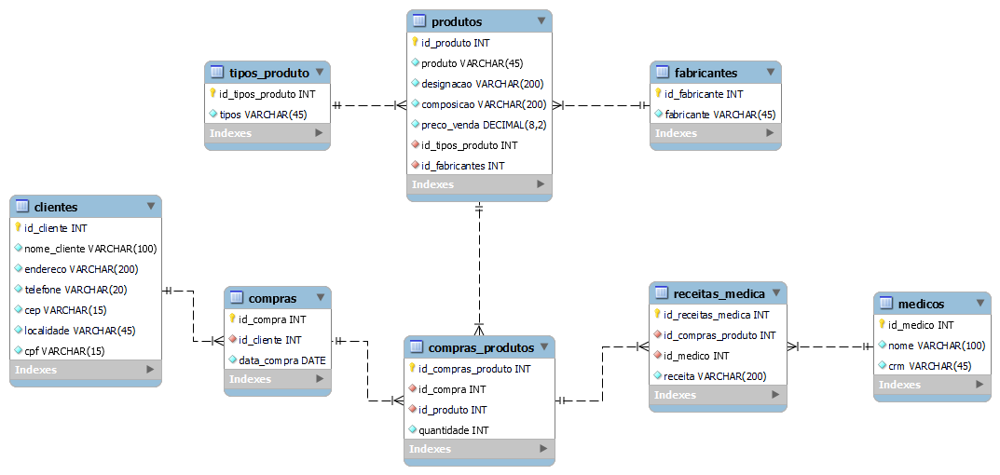

# Modelagem de Banco de Dados Farmácia
Projeto simples de modelagem de um Banco de Dados de uma farmácia
_Desenvolvido no curso Banco de Dados SQL e NoSQL da GeekUniversity na Udemy_

## Introdução ao curso
Dentro dos primeiros módulos do curso aprendi sobre: 
  - Banco de Dados
  - Normalização
  - Modelagem de Banco de Dados
  - Modelo Entidade Relacionamento

Aplicado com MySQL 8.0 no MySQL Workbench

## Atualmente
Finalizando este modulo de MySQL, darei inicio ao estudo com do DBMS PostgreSQL, contudo continuarei desenvolvendo projetos pessoais em MySQL.
